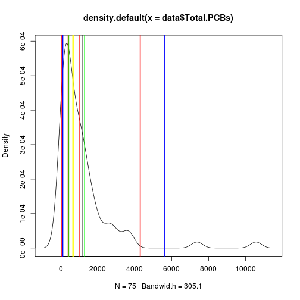

Bootstrap重采样技术在环境污染调查中的应用
========================================================
author: 于淼
date: 2013年12月13日

目录
========================================================

> 环境调查的可靠性
    
    - 样本数
    - 异常值
    - 模型假设

> bootstrap 重采样技术
    
    - 原理
    - 应用

> 示例
    
    - 普吉特海湾多氯联苯（PCBs）调查数据分析

环境调查的可靠性
========================================================
type: section

## 安斯库姆四重奏

环境调查的可靠性
========================================================
- 样本数
    - 功效分析 
    
- 异常值
    - 剔除还是保留
    - 样本有限

- 模型假设
    - 残差正态
    - 模型的诊断与有效性

Bootstrap
========================================================
type: section

- 小样本分布更多依赖概率密度分布而非预设分布

- 把样本看作总体进行有放回的重采样

- 重复n次进行估计

- plug-in 原则 —— 样本对总体的估计逼近

- Monte Carlo 模拟 —— 大数定律

示例：普吉特海湾PCBs开放数据
========================================================

- EPA公布于Socrata.com

- 75个底泥样品采样点数据与污染物浓度数据

- 只关注PCBs总浓度与采样深度两个变量

***

PCBs总浓度描述
========================================================

- 假定75为总体，从中随机抽取30个为样本，进行浓度描述

- 中位数 or 均值

- 点估计 or 区间估计

 

- bootstrap
    
bootstrap
========================================================
type: alart

> *模型是现实的简化，不是产生现象的原因*

> *主要规律不受异常值影响*

> *非参区间估计*

重采样演示
========================================================

<link rel="stylesheet" href="http://vis.supstat.com//assets/themes/dinky/css/scianimator.css">

将样本看成总体 有放回的反复抽样
========================================================

