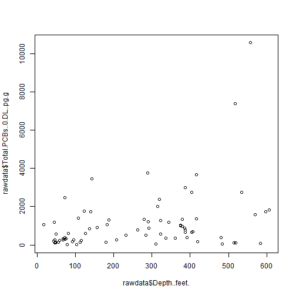
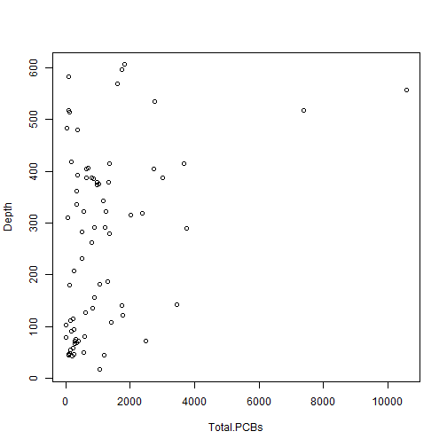
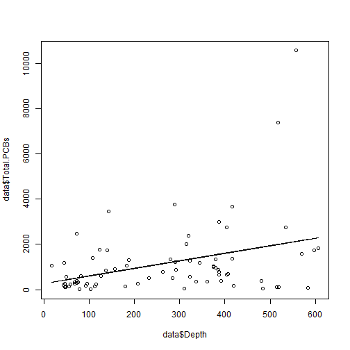
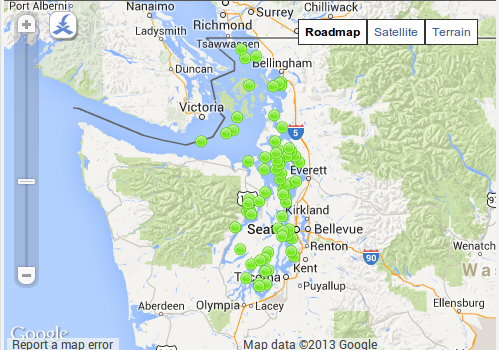
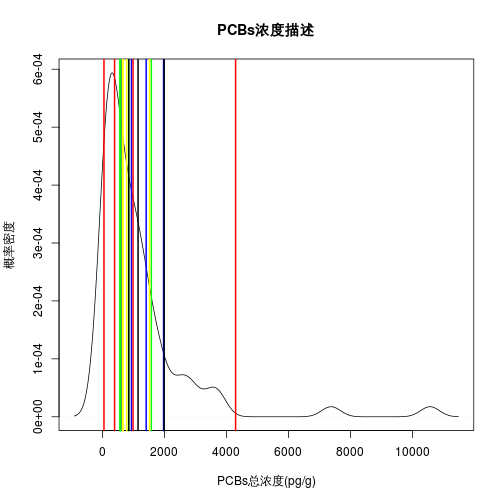

Bootstrap重采样技术在环境污染调查中的应用
========================================================

环境污染调查所得到的数据在可靠性上容易被质疑，这种质疑一方面来自于小样本数据中异常值的解释而另一方面则来自于数据分析所采用模型背后的假设。Bootstrap重采样技术在统计学领域常用来解决小样本无分布假设问题，具有良好的鲁棒性与预测性能。通过将样本看作总体进行有放回的多次重采样并进行模拟求解，在不清楚样本所符合的分布条件下可以给出可靠性更高的中位数95%置信区间估计值，这使得对现实环境污染物污染水平的描述更准确。此外，结合局部加权回归散点平滑法（LOESS算法）与可视化技术，采用Bootstrap重采样技术可更好的讨论环境变量间的关系，挖掘数据背后的规律。通过对EPA公开的普吉特海湾多氯联苯（PCBs）调查数据的Bootstrap模拟分析发现：PCBs浓度随深度增加而增加的线性模型受采样点设置的影响而并不稳健，深度0~200米PCBs浓度随深度增加而增加，在300米附近浓度呈稳定趋势，而深度400米之后的浓度波动较大。

数据分析


```r
rawdata <- read.csv("2008_BOLD_Survey_of_Puget_Sound_Levels_for_PCB_Congeners_Raw_Data.csv")
# 查看列名 colnames(rawdata) 观察总浓度与深度关系
plot(rawdata$Depth..feet., rawdata$Total.PCBs..0.DL..pg.g)
```

 

```r
# bootstrap重采样
Total.PCBs <- rawdata$Total.PCBs..0.DL..pg.g
Depth <- rawdata$Depth..feet.
data <- cbind(Total.PCBs, Depth)
data <- data.frame(data)
plot(data)
```

 

```r
b <- c(0)
c <- c(0)

# 总体取样30进行区间估计
a <- sample(75, 30)
subdatatest <- data[a, ]

for (i in 1:1000) {
    a <- sample(30, replace = T)
    sub <- subdatatest[a, ]
    b[i] <- mean(sub$Total.PCBs)
    c[i] <- median(sub$Total.PCBs)
}

cib <- quantile(b, probs = c(0.025, 0.975))
cic <- quantile(c, probs = c(0.025, 0.975))
cip <- quantile(data$Total.PCBs, probs = c(0.025, 0.975))
cis <- quantile(subdatatest$Total.PCBs, probs = c(0.025, 0.975))

# 绘制区间估计图
hist(sub$Total.PCBs, breaks = 20)
```

 

```r
hist(data$Total.PCBs, breaks = 20)
abline(v = cip, col = "red", lwd = 2)
abline(v = cic, col = "green", lwd = 2)
abline(v = cis, col = "blue", lwd = 2)
abline(v = mean(data$Total.PCBs), col = "black")
abline(v = median(data$Total.PCBs), col = "yellow", , lwd = 3)
```

 

```r

# 与深度关系

fit <- lm(data$Total.PCBs ~ data$Depth)
plot(data$Total.PCBs ~ data$Depth)
lines(data$Depth, fit$fitted)
```

 

```r

# p值0.001525 r^2 0.1294

fit2 <- loess(data$Total.PCBs ~ data$Depth)
plot(data$Total.PCBs ~ data$Depth)
lines(lowess(data$Depth, fit2$fitted))
```

 

```r

# 局部加权回归散点平滑法

plot(data$Total.PCBs ~ data$Depth, pch = 20, col = rgb(0, 0, 0, 0.5))
for (i in 1:300) {
    idx = sample(75, replace = TRUE)
    lines(lowess(data$Depth[idx], data$Total.PCBs[idx]), col = rgb(0, 0, 0, 
        0.05), lwd = 1.5)
}
lines(data$Depth, fit$fitted)
```

 


================================================

Bootstrap重采样技术在环境污染调查中的应用
========================================================
author: 于淼
date: 2013年12月13日

目录
========================================================

> 环境调查的可靠性
    
    - 样本数
    - 异常值
    - 模型假设

> bootstrap 重采样技术
    
    - 原理
    - 应用

> 示例
    
    - 普吉特海湾多氯联苯（PCBs）调查数据分析

环境调查的可靠性
========================================================
type: section

## 安斯库姆四重奏


环境调查的可靠性
========================================================
- 样本数
    - 功效分析 
    
- 异常值
    - 剔除还是保留
    - 样本有限

- 模型假设
    - 残差正态
    - 模型的诊断与有效性

Bootstrap
========================================================
type: section

- 小样本分布更多依赖概率密度分布而非预设分布

- 把样本看作总体进行有放回的重采样

- 重复n次进行估计

- plug-in 原则 —— 样本对总体的估计逼近

- Monte Carlo 模拟 —— 大数定律

示例：普吉特海湾PCBs开放数据
========================================================

- EPA公布于Socrata.com

- 75个底泥样品采样点数据与污染物浓度数据

- 只关注PCBs总浓度与采样深度两个变量

***



PCBs总浓度描述
========================================================

- 假定75为总体，从中随机抽取30个为样本，进行浓度描述

- 中位数 or 均值

- 点估计 or 区间估计

- Bootstrap对中位数进行区间估计


```
## Warning: 'mbcsToSbcs'里转换'PCBs浓度描述'出错：<e6>代替了dot
## Warning: 'mbcsToSbcs'里转换'PCBs浓度描述'出错：<b5>代替了dot
## Warning: 'mbcsToSbcs'里转换'PCBs浓度描述'出错：<93>代替了dot
## Warning: 'mbcsToSbcs'里转换'PCBs浓度描述'出错：<e5>代替了dot
## Warning: 'mbcsToSbcs'里转换'PCBs浓度描述'出错：<ba>代替了dot
## Warning: 'mbcsToSbcs'里转换'PCBs浓度描述'出错：<a6>代替了dot
## Warning: 'mbcsToSbcs'里转换'PCBs浓度描述'出错：<e6>代替了dot
## Warning: 'mbcsToSbcs'里转换'PCBs浓度描述'出错：<8f>代替了dot
## Warning: 'mbcsToSbcs'里转换'PCBs浓度描述'出错：<8f>代替了dot
## Warning: 'mbcsToSbcs'里转换'PCBs浓度描述'出错：<e8>代替了dot
## Warning: 'mbcsToSbcs'里转换'PCBs浓度描述'出错：<bf>代替了dot
## Warning: 'mbcsToSbcs'里转换'PCBs浓度描述'出错：<b0>代替了dot
## Warning: 'mbcsToSbcs'里转换'PCBs总浓度'出错：<e6>代替了dot
## Warning: 'mbcsToSbcs'里转换'PCBs总浓度'出错：<80>代替了dot
## Warning: 'mbcsToSbcs'里转换'PCBs总浓度'出错：<bb>代替了dot
## Warning: 'mbcsToSbcs'里转换'PCBs总浓度'出错：<e6>代替了dot
## Warning: 'mbcsToSbcs'里转换'PCBs总浓度'出错：<b5>代替了dot
## Warning: 'mbcsToSbcs'里转换'PCBs总浓度'出错：<93>代替了dot
## Warning: 'mbcsToSbcs'里转换'PCBs总浓度'出错：<e5>代替了dot
## Warning: 'mbcsToSbcs'里转换'PCBs总浓度'出错：<ba>代替了dot
## Warning: 'mbcsToSbcs'里转换'PCBs总浓度'出错：<a6>代替了dot
## Warning: 'mbcsToSbcs'里转换'概率密度'出错：<e6>代替了dot
## Warning: 'mbcsToSbcs'里转换'概率密度'出错：<a6>代替了dot
## Warning: 'mbcsToSbcs'里转换'概率密度'出错：<82>代替了dot
## Warning: 'mbcsToSbcs'里转换'概率密度'出错：<e7>代替了dot
## Warning: 'mbcsToSbcs'里转换'概率密度'出错：<8e>代替了dot
## Warning: 'mbcsToSbcs'里转换'概率密度'出错：<87>代替了dot
## Warning: 'mbcsToSbcs'里转换'概率密度'出错：<e5>代替了dot
## Warning: 'mbcsToSbcs'里转换'概率密度'出错：<af>代替了dot
## Warning: 'mbcsToSbcs'里转换'概率密度'出错：<86>代替了dot
## Warning: 'mbcsToSbcs'里转换'概率密度'出错：<e5>代替了dot
## Warning: 'mbcsToSbcs'里转换'概率密度'出错：<ba>代替了dot
## Warning: 'mbcsToSbcs'里转换'概率密度'出错：<a6>代替了dot
```

 

- bootstrap
    
bootstrap
========================================================
type: alart

> *模型是现实的简化，不是产生现象的原因*

> *主要规律不受异常值影响*

> *非参区间估计*

重采样演示
========================================================


<link rel="stylesheet" href="http://vis.supstat.com//assets/themes/dinky/css/scianimator.css">
<script src="https://ajax.googleapis.com/ajax/libs/jquery/1.7.1/jquery.min.js"></script>
<script src="http://vis.supstat.com/assets/themes/dinky/js/jquery.scianimator.min.js"></script>

<div class="scianimator">
<div id="test" style="display: inline-block;">
</div>
</div>
<script type="text/javascript">
  (function($) {
    $(document).ready(function() {
      var imgs = Array(50);
      for (i=0; ; i++) {
        if (i == imgs.length) break;
        imgs[i] = "figure/test" + (i + 1) + ".png";
      }
      $("#test").scianimator({
          "images": imgs,
          "delay": 100,
          "controls": ["first", "previous", "play", "next", "last", "loop", "speed"],
      });
      $("#test").scianimator("play");
    });
  })(jQuery);
</script>


将样本看成总体 有放回的反复抽样
========================================================
